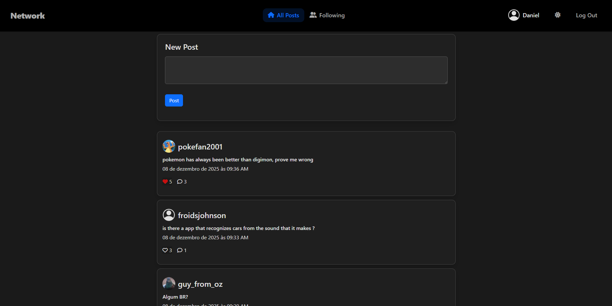
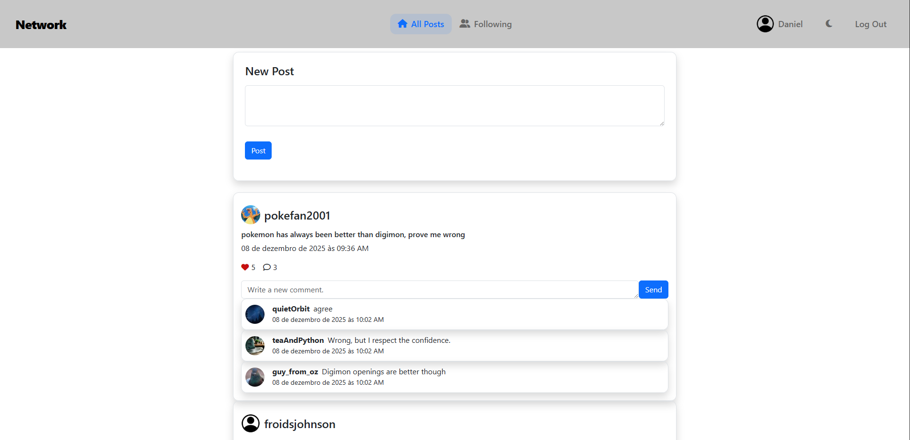
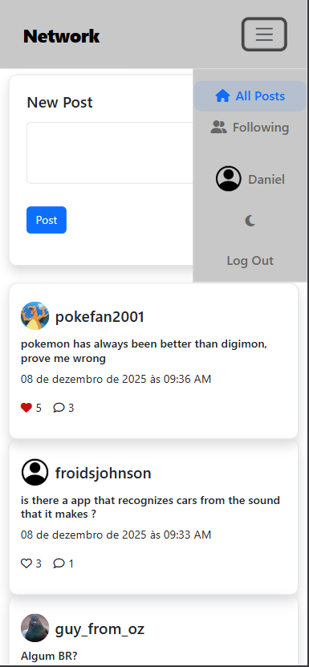

<p align="center">
  
  
   
  
  
   
  
  
</p>

# Full-Stack Social Network

<p align="center">
  
</p>

[GitHub Repo Link](https://github.com/Landuche/social-network)

This project was built as a professional portfolio application, demonstrating production-grade architecture, atomic database operations, optimized queries, and clean separation between frontend, backend, and business logic.

It provides a social feed with infinite scrolling, dynamic post interactions, real-time UI updates, and profile management.

## Project Highlights

- **100% Test Coverage:** Guarantees robustness and integrity across all 500+ statements using Pytest and Django Test Client.
- **Atomic Denormalization:** Ensures data consistency and concurrency safety, preventing race conditions, using `transaction.atomic` and `F()` expressions
- **Full Single-Page Application (SPA):** All app flows are managed client-side using `Vanilla JavaScript ES6 modular architecture` and central state.
- **JSON API:** All app operations are handled by JSON endpoints.
- **Improved User Experience:** Features a fully implemented dark mode with user preference persistence, dynamic styling, and promise-based animations.
- **Query Optimization:** Implements custom composite indexes and double cursor based pagination, managing consistency even on larger datasets. N+1 problems are eliminated using `select_related` and `prefetch_related` to minimize database round trips.
- **PostgreSQL Functional Constraints:** Enforces case-insensitive uniqueness on usernames and emails at database level.

## Core Features

- **User Management:** Registration, login and profile editing without page reloads.
- **Social Feed:** View posts from all users or from followed users.
- **Interactions:** Create, edit, and delete Posts and Comments. Like/Unlike posts with real time UI updates.
- **Profiles:** Follow/Unfollow users with real time UI updates.

## Tech Stack

- **Backend:** Django 5.x / Python 3.13 + django-versatileimagefield.
- **Frontend:** JavaScript ES6 modules + Intersection Observer.
- **Database:** PostgreSQL.
- **Testing:** Pytest + Django Test Client.
- **Deployment:** Docker, Docker Compose, Gunicorn, Nginx, WhiteNoise.

## Screenshots

<p align="center">
  
</p>
<br>
<p align="center">
  
  
</p>

## Deployment Architecture

| Component             | Technology                               | Purpose                                      |
|-----------------------|------------------------------------------|----------------------------------------------|
| Web Server            | Nginx 1.25-alpine                        | Reverse proxy, serves static/media, TLS termination |
| Application Server    | Gunicorn 23 + Python 3.13                | WSGI server, 4 workers, 300s timeout         |
| Framework             | Django 5.x                               | Full-stack backend + admin                   |
| Database              | PostgreSQL 16-alpine                     | Persistent storage                           |
| Static Files          | WhiteNoise (local) → Nginx (docker)      | Zero-downtime asset delivery                 |
| Media/Thumbnails      | versatileimagefield + Nginx              | On the fly resizing, served directly         |
| Configuration         | python-dotenv + dj-database-url          | Single codebase between local and docker     |
| Containerization      | Docker + Docker Compose                  | Reproducible environment                     |

## Setup And Run

### Run Locally

```bash
git clone https://github.com/Landuche/social-network
cd social-network
cp .env.local.example .env.local # Configure your database on this file
python -m venv venv
venv\Scripts\activate
pip install -r requirements-local.txt
pip install python-magic-bin
python manage.py migrate
python manage.py collectstatic
python manage.py runserver
```

### Run Container With Docker

```bash
cp .env.example .env # Configure your database on this file
docker compose up --build
```

## Data Initialization

### Seed Database Locally

```bash
Copy-Item -Path .\fixtures\assets\ -Destination .\media -Recurse -Force
python manage.py loaddata fixtures\initial_data.json
```

### Seed Database On Docker

```bash
docker cp ./fixtures/assets/profile_pics/ social-network-web-1:/app/media
docker compose exec web python manage.py loaddata fixtures/initial_data.json
```

## Testing

### Test Locally

```bash
pip install -r requirements-test.txt
pytest -v -n auto
```

### Test Container On Docker

```bash
docker compose exec web python -m pytest -v -n auto
```